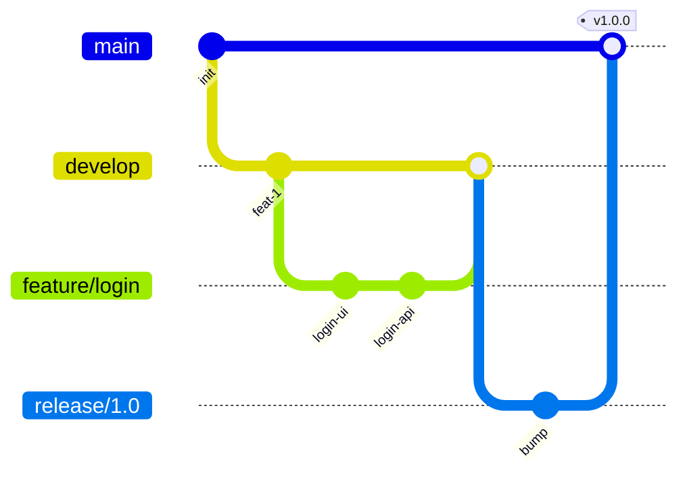

# Git Workflow

## Branches



## Commits convencionais

Usamos **Conventional Commits**:

| Prefixo | Uso |
|:---------|:----|
| `feat:` | Nova funcionalidade |
| `fix:` | Correção de bug |
| `docs:` | Documentação |
| `refactor:` | Refatoração |
| `test:` | Testes |
| `chore:` | Tarefas internas |

!!! example "Exemplos"
    ```
    feat: adicionar endpoint de pedidos
    fix: corrigir validação de CPF
    docs: atualizar guia de onboarding
    ```

## Code Review

??? tip "Checklist do reviewer"
    - [ ] Testes passando?
    - [ ] Cobertura adequada?
    - [ ] Segue Clean Architecture?
    - [ ] Documentação atualizada?
    - [ ] Sem secrets hardcoded?