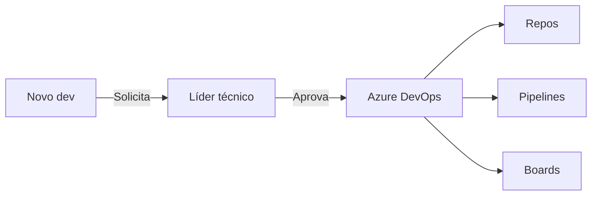

# Guia de Onboarding

## Checklist do primeiro dia

- [x] Acesso ao Azure DevOps
- [x] Clonar repositórios
- [ ] Configurar ambiente local
- [ ] Ler o Git Workflow
- [ ] Conhecer a arquitetura

## Ferramentas

=== "Backend"

    ```csharp title="Exemplo: Endpoint mínimo"
    app.MapGet("/health", () => Results.Ok(new { status = "healthy" }));
    ```

=== "Frontend"

    ```typescript title="Exemplo: Component"
    @Component({ selector: 'app-health', template: '{{ status }}' })
    export class HealthComponent { status = 'OK'; }
    ```

## Fluxo de acesso



!!! warning "VPN obrigatória"
    Todos os acessos internos requerem VPN ativa.
    Veja o guia de configuração no Confluence.

!!! info "Dúvidas?"
    Canal do Teams: **#time-backend**

## Ambientes

| Ambiente | URL | Branch |
|:---------|:----|:-------|
| Dev | dev.app.internal | develop |
| Staging | stg.app.internal | release/* |
| Produção | app.meudominio.com | main |